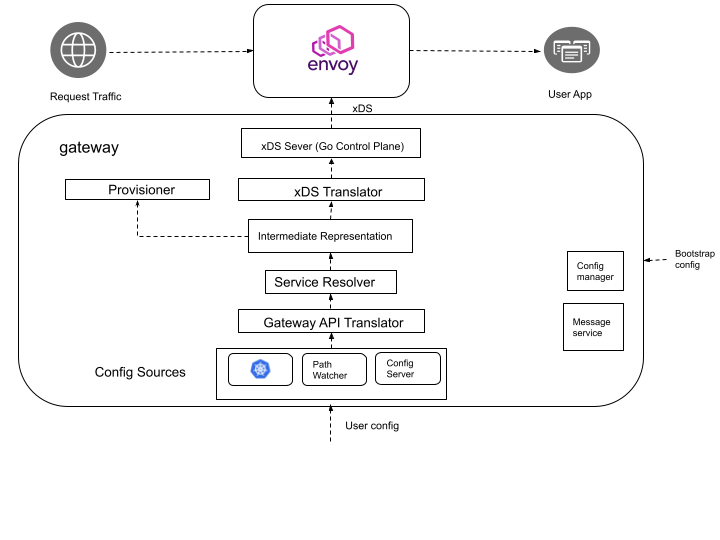

## System Design

### Goals
* Define the system components needed to satisfy the requirements of Envoy Gateway.

### Non-Goals
* Create a detailed design and interface specification for each system component.

### Architecture


### Configuration

#### Bootstrap Config
This is the configuration provided by the Infrastructure Administrator that allows them to bootstrap and configure various internal aspects of Envoy Gateway.
It can be defined using a CLI argument similar to what [Envoy Proxy has](https://www.envoyproxy.io/docs/envoy/latest/operations/cli#cmdoption-c).
For e.g. users wanting to run Envoy Gateway in Kubernetes and use a custom [Envoy Proxy bootstrap config](https://www.envoyproxy.io/docs/envoy/latest/api-v3/config/bootstrap/v3/bootstrap.proto#envoy-v3-api-msg-config-bootstrap-v3-bootstrap) could define their Bootstrap Config as -
```
platform: kubernetes
envoyProxy:
  bootstrap: 
    ......
```

#### User Config
This configuration is based on the [Gateway API](https://gateway-api.sigs.k8s.io) and will provide:
* Infrastructure Management capabilities to provision the infrastructure required to run the data plane, Envoy Proxy.
This is expressed using [GatewayClass](https://gateway-api.sigs.k8s.io/concepts/api-overview/#gatewayclass) and [Gateway](https://gateway-api.sigs.k8s.io/concepts/api-overview/#gateway) resources.
* Ingress and API Gateway capabilities for the application developer to define networking and security intent for their incoming traffic.
This is expressed using [HTTPRoute](https://gateway-api.sigs.k8s.io/concepts/api-overview/#httproute) and [TLSRoute](https://gateway-api.sigs.k8s.io/concepts/api-overview/#tlsroute).

#### Workflow
See the [user workflow](./USER_WORKFLOW.md) document for additional details on how to configure and run Envoy Gateway.

### Components

#### Config Sources
This component is responsible for consuming the user configuration from various platforms. Data persistence should be tied to the specific config source’s capabilities. For e.g. in Kubernetes, the resources will persist in `etcd`, if using the `path-watcher`, the resources will persist in a file.

##### Kubernetes
It watches the Kubernetes API Server for resources, fetches them, and publishes it to the translators for further processing.

##### Path Watcher
It watches for file changes in a path, allowing the user to configure Envoy Gateway using resource configurations saved in a file or directory.

##### Config Server
This is a HTTP/gRPC Server allowing Envoy Gateway to be configured from a remote endpoint. 

#### Intermediate Representation (IR)
This is an internal data model that user facing APIs are translated into allowing for internal services & components to be decoupled. 

#### Config Manager
This component consumes the [Bootstrap Config](#bootstrap-config), and spawns the appropriate internal services in Envoy Gateway based on the config specification.
For e.g. if the platform field in the Bootstrap Config is set to `kubernetes`, the Config Manager will instantiate kubernetes controller services that implement the
[Config Source](#config-source), [Service Resolver](#service-resolver) and the [Envoy Provisioner](#provisioner) interfaces.

#### Message Service
This component allows internal services to publish messages as well as subscribe to them. The message service's interface is used by the [Config Manager](#config-manager) to 
allow communication between the services instantiated by it.
A message bus architecture allows components to be loosely coupled, work in an asynchronous manner and also scale out into multiple processes if needed. 
For e.g. the [Config Source](#config-source) and the [Provisioner](#provisoner) could run as separate processes in different environments decoupling user configuration consumption
from the environment where the Envoy Proxy infrastructure is being provisioned.

#### Service Resolver
This optional component preprocesses the IR resources and resolves the services into endpoints enabling precise load balancing and resilience policies.
For e.g. in Kubernetes, a controller service could watch for EndpointSlice resources, converting Services to Endpoints, allowing for Envoyproxy to skip kube-proxy’s
load balancing layer. This component is tied to the platform where it is running.  When disabled, the services will be resolved by the underlying DNS resolver or
by explicitly specifying IPs.

#### Gateway API Translator
This is a platform agnostic translator that translates Gateway API resources to an Intermediate Representation.

#### xDS Translator
This component translates the IR into Envoy Proxy xDS Resources.

#### xDS Server
This component is a xDS gRPC Server based on the [Envoy Go Control Plane](https://github.com/envoyproxy/go-control-plane) project that implements the xDS Server Protocol
and is responsible for configuring xDS resources in Envoy Proxy. 

#### Provisioner
The provisioner configures any infrastructure needed based on the IR.

* Envoy - This is a platform specific component that provisions all the infrastructure required to run the managed Envoy Proxy fleet. 
For example, a Terraform or Ansible provisioner could be added in the future to provision the Envoy infrastructure in a non-Kubernetes environment.

* Auxiliary Control Planes - These optional components are services needed to implement API Gateway features that require external integrations with Envoy Proxy. A good example is [Global Ratelimiting](https://www.envoyproxy.io/docs/envoy/latest/intro/arch_overview/other_features/global_rate_limiting) which would require instatiating and 
configuring the [Envoy Rate Limit Service](https://github.com/envoyproxy/ratelimit) as well the [Rate Limit filter](https://www.envoyproxy.io/docs/envoy/latest/api-v3/extensions/filters/http/ratelimit/v3/rate_limit.proto#envoy-v3-api-msg-extensions-filters-http-ratelimit-v3-ratelimit) using the IR passed to this component. Such features would
be exposed to the user using [Custom Route Filters](https://gateway-api.sigs.k8s.io/v1alpha2/api-types/httproute/#filters-optional) defined in the Gateway API.

### Design Decisions
* Each Envoy Gateway will consume one or more [GatewayClass resources](https://gateway-api.sigs.k8s.io/concepts/api-overview/#gatewayclass) to manage a fleet of Envoy Proxies
with different configurations i.e. each [GatewayClass resource](https://gateway-api.sigs.k8s.io/concepts/api-overview/#gatewayclass) will map to a unique set of Envoy Proxies
created by the Provisioner.
* Mapping the [Gateway API](https://gateway-api.sigs.k8s.io) to the Envoy based data plane - 
  * A [GatewayClass resource](https://gateway-api.sigs.k8s.io/concepts/api-overview/#gatewayclass) maps to a unique data plane i.e. a managed Envoy Proxy fleet
  * A [Gateway resource](https://gateway-api.sigs.k8s.io/concepts/api-overview/#gateway) maps to a listener configuration within a specific data plane (such as port, protocol fields within a Kubernetes Service) as well as a [Envoy Listener resource](https://www.envoyproxy.io/docs/envoy/latest/api-v3/config/listener/v3/listener.proto#envoy-v3-api-msg-config-listener-v3-listener)
  * A [HTTPRoute resource](https://gateway-api.sigs.k8s.io/concepts/api-overview/#httproute) maps to a [Envoy Route Configuration](https://www.envoyproxy.io/docs/envoy/latest/api-v3/config/route/v3/route.proto#config-route-v3-routeconfiguration) .Each [backendRefs](https://gateway-api.sigs.k8s.io/v1alpha2/api-types/httproute/#backendrefs-optional) maps to a [Envoy Cluster resource](https://www.envoyproxy.io/docs/envoy/latest/api-v3/config/cluster/v3/cluster.proto#config-cluster-v3-cluster)
* The goal is to make the Provisioner & Translator layers extensible, but for the near future, extensibility can be achieved using xDS support that Envoy Gateway
will provide.

The draft for this document is [here](https://docs.google.com/document/d/1riyTPPYuvNzIhBdrAX8dpfxTmcobWZDSYTTB5NeybuY/edit)
