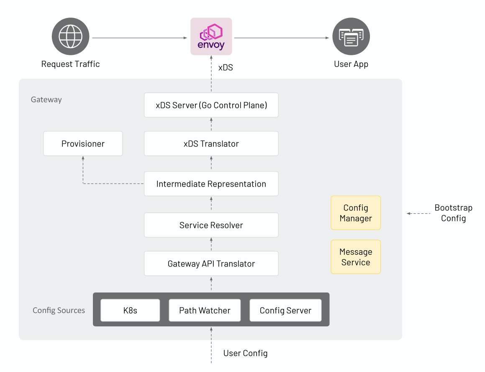

## System Design

### Goals
* Define the system components needed to satisfy the requirements of Envoy Gateway.

### Non-Goals
* Create a detailed design and interface specification for each system component.

### Terminology
* Control Plane- A collection of inter-related software components for providing application gateway and routing
  functionality. The control plane is implemented by Envoy Gateway and provides services for managing the data plane.
  These services are detailed in the [components](#components) section.
* Data Plane- Provides intelligent application-level traffic routing and is implemented by Envoy proxy. Envoy Gateway
  manages the data plane as one or more Envoy proxies.

### Architecture

### Configuration
Envoy Gateway is configured statically at runtime and the managed data plane is configured dynamically through
[Gateway API][gw_api] objects.

#### Static Configuration
This is the configuration used to configure various internal aspects of Envoy Gateway at runtime. Currently, Envoy
Gateway only supports runtime configuration through a configuration file. See the [configuration](../CONFIG.md) guide
for additional details.

#### Dynamic Configuration
Dynamic configuration manages the data plane through [Gateway API][gw_api] objects, e.g. Gateway, HTTPRoute, etc. and
provides the following services:
* Infrastructure Management- Capabilities to manage, e.g. deploy, upgrade, etc. the data plane infrastructure. This is
  expressed using [GatewayClass][gc] and [Gateway][gw] resources.
* Traffic Routing- Capabilities that define how to handle application-level requests to backend services. This is
  expressed using [HTTPRoute][hroute] and [TLSRoute][troute].

#### Configuration Workflow
See the [configuration](../CONFIG.md) guide for additional details on how to configure and run Envoy Gateway.

### Components

#### Providers
Providers are infrastructure components that Envoy Gateway calls to establish its
[dynamic configuration](#dynamic-configuration), resolve services, persist data, and provide additional services through
extensions. Only Kubernetes and File providers are currently defined. However, other providers can be added in the
future as Envoy Gateway use cases are better understood.

##### Kubernetes Provider
* Uses Kubernetes-style controllers to reconcile managed Kubernetes resources.
* Manages the data plane infrastructure through CRUD operations of Kubernetes resources.
* Use Kubernetes for Service discovery.
* Uses etcd (via Kubernetes API) to persist data.

##### File Provider

* Watches files in a directory to manage Envoy.
* Manages the data plane infrastructure by calling internal APIs, e.g. `CreateDataPlane()`.
* Use DNS for Service discovery.
* If needed, the local filesystem is used to persist data.

#### Intermediate Representation (IR)
This is an internal data model that user facing APIs are translated into allowing for internal services & components to
be decoupled.

#### Gateway API Translator
The Gateway API Translator translates Gateway API resources to the Intermediate Representation (IR).

#### xDS Translator
The xDS Translator translates the IR into xDS Resources.

#### xDS Server
The xDS Server is a xDS gRPC Server based on [Go Control Plane][go_cp]. Go Control Plane implements the xDS Server
Protocol and is responsible for using xDS to configure the data plane.

#### Infra Manager
The Infra Manager is a provider-specific component responsible for managing the following infrastructure:

* Data Plane - Manages all the infrastructure required to run the managed Envoy proxies. For example, CRUD Deployment,
  Service, etc. resources to run Envoy in a Kubernetes cluster.
* Auxiliary Control Planes - Optional infrastructure needed to implement application Gateway features that require
  external integrations with the managed Envoy proxies. For example, [Global Rate Limiting][grl] requires provisioning
  and configuring the [Envoy Rate Limit Service][rls] and the [Rate Limit filter][rlf]. Such features are exposed to
  users through the [Custom Route Filters][crf] extension.

### Design Decisions
* Envoy Gateway will consume one [GatewayClass][gc] by comparing its configured controller name with
  `spec.controllerName` of a GatewayClass. If multiple GatewayClasses exist with the same `spec.controllerName`, Envoy
  Gateway will follow Gateway API [guidelines][gwapi_conflicts] to resolve the conflict.
  `gatewayclass.spec.parametersRef` refers to a custom resource for configuring the managed proxy infrastructure. If
  unspecified, default configuration parameters are used.
* Envoy Gateway will manage [Gateways][gw] that reference its GatewayClass.
  * The first Gateway causes Envoy Gateway to provision the managed Envoy proxy infrastructure.
  * Envoy Gateway will merge multiple Gateways that match its GatewayClass and follow Gateway API
    [guidelines][gwapi_conflicts] to resolve any conflicts.
  * A Gateway `listener` corresponds to a proxy [Listener][listener].
* An [HTTPRoute][hroute] resource corresponds to a proxy [Route][route].
  * Each [backendRef][be_ref] corresponds to a proxy [Cluster][cluster].
* The goal is to make the Infra Manager & Translator components extensible in the future. For now, extensibility can be
  achieved using xDS support that Envoy Gateway will provide.

The draft for this document is [here][draft_design].

[gw_api]: https://gateway-api.sigs.k8s.io
[gc]: https://gateway-api.sigs.k8s.io/concepts/api-overview/#gatewayclass
[gw]: https://gateway-api.sigs.k8s.io/concepts/api-overview/#gateway
[hroute]: https://gateway-api.sigs.k8s.io/concepts/api-overview/#httproute
[troute]: https://gateway-api.sigs.k8s.io/concepts/api-overview/#tlsroute
[go_cp]: https://github.com/envoyproxy/go-control-plane
[grl]: https://www.envoyproxy.io/docs/envoy/latest/intro/arch_overview/other_features/global_rate_limiting
[rls]: https://github.com/envoyproxy/ratelimit
[rlf]: https://www.envoyproxy.io/docs/envoy/latest/api-v3/extensions/filters/http/ratelimit/v3/rate_limit.proto#envoy-v3-api-msg-extensions-filters-http-ratelimit-v3-ratelimit
[crf]: https://gateway-api.sigs.k8s.io/v1alpha2/api-types/httproute/#filters-optional
[gwapi_conflicts]: https://gateway-api.sigs.k8s.io/concepts/guidelines/#conflicts
[listener]: https://www.envoyproxy.io/docs/envoy/latest/configuration/listeners/listeners#config-listeners
[route]: https://www.envoyproxy.io/docs/envoy/latest/api-v3/config/route/v3/route.proto#config-route-v3-routeconfiguration
[be_ref]: https://gateway-api.sigs.k8s.io/v1alpha2/api-types/httproute/#backendrefs-optional
[cluster]: https://www.envoyproxy.io/docs/envoy/latest/api-v3/config/cluster/v3/cluster.proto#config-cluster-v3-cluster
[draft_design]: https://docs.google.com/document/d/1riyTPPYuvNzIhBdrAX8dpfxTmcobWZDSYTTB5NeybuY/edit
