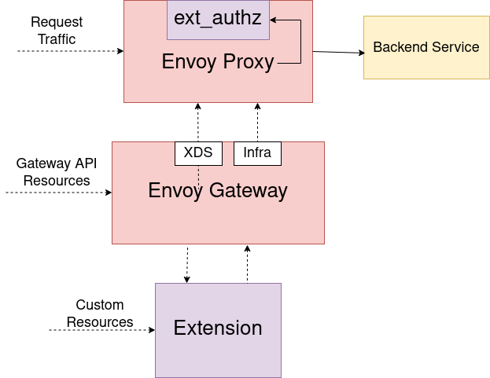

# Envoy Gateway Extensions Design

As outlined in the [official goals][] for the Envoy Gateway project, one of the main goals is to "provide a common foundation for vendors to build value-added products 
without having to re-engineer fundamental interactions". Development of the Envoy Gateway project has been focused on developing the core features for the project and 
Kubernetes Gateway API conformance. This system focuses on the “common foundation for vendors” component by introducing a way for vendors to extend Envoy Gateway.

To meaningfully extend Envoy Gateway and provide additional features, Extensions need to be able to introduce their own custom resources and have a high level of control
over the configuration generated by Envoy Gateway. Simply applying some static xDS configuration patches or relying on the existing Gateway API resources are both insufficient on their own
as means to add larger features that require dynamic user-configuration.

As an example, an extension developer may wish to provide their own out of the box authentication filters that require configuration from the end-user. This is a scenario where the ability to introduce
custom resources and attach them to [HTTPRoute][]s as an [ExtensionRef][] is necessary. Providing the same feature through a series of xDS patch resources would be too cumbersome for many end-users that want to avoid
that level of complexity when managing their clusters.  

## Goals

- Provide a foundation for extending the Envoy Gateway control plane
- Allow Extension Developers to introudce their own cusom resources for extending the Gateway-API via [ExtensionRefs][], [policyAttachments][] (future) and [backendRefs][] (future).
- Extension developers should **NOT** have to maintain a custom fork of Envoy Gateway
- Provide a system for extending Envoy Gateway which allows extension projects to ship updates independent of Envoy Gateway's release schedule
- Extensions can hook into both the Envoy configuration pipeline and the infra manager pipeline
- Modify the generated Envoy xDS and Envoy Gateway infra config (either directly via an xDS hook or earlier in the pipeline or by dynamically adding resources)
- Setup a foundation for the initial iteration of Extending Envoy Gateway

## Non-Goals

- The initial deisgn does not capture every hook that Envoy Gateway will eventually support.
- Extend [Gateway API Policy Attachments][]. At some point these will be addressed using this extension system, but the initial implementation omits these.
- Guarantee that multiple extensions will work together without conflicts

## Overview

Envoy Gateway can be extended by vendors by means of an extension server developed by the vendor and deployed alongside Envoy Gateway.
An extension server can make use of one or more pre/post hooks inside Envoy Gateway before and after it's major components (translator, etc.) to allow the extension to modify the data going into or coming out of these components.
An extension can be created external to Envoy Gateway as it's own Kubernetes deployment or loaded as a sidecar. gRPC is used for the calls between Envoy Gateway and an extension. In the hook call, Envoy Gateway sends data as well 
as context information to the extension and expects a reply with a modified version of the data that was sent to the extension. Since extensions fundamentally alter the logic and data that Envoy Gateway provides, Extension projects assume responsibility for any bugs and issues 
they create as a direct result of their modification of Envoy Gateway.

## Diagram


## Registering Extensions in Envoy Gateway

Information about the extensions that Envoy Gateway needs to load is configured in the Envoy Gateway config. Each extension must specify:

- The name to register the extension under
- Which API groups the extension supports
- The `Kind`s supported under each API group
- Extension service connection info (host, port, TLS settings, etc.)

An example configuration:

```yaml
apiVersion: config.gateway.envoyproxy.io/v1alpha1
kind: EnvoyGateway
extensions:
  - name: example-extension
    apiGroups:
      - apiGroup: example.myextension.io
        kinds:
          - OAuth2Filter
    service:
      host: my-extension.example
      port: 443
      tls:
        type: secret
        secret:
            name: my-extension
            namespace: example
```

This configuration is required to be provided at bootstrap and modifying the registered extensions during runtime is not currently supported.
Envoy Gateway will keep track of the registered extensions and their `apiGroups` and `kinds` when processing Gateway API resources.

## Extending Gateway API and the Data Plane

Envoy Gateway manages [Envoy][] deployments, which act as the data plane that handles actual user traffic. Users configure the data plane using the K8s Gateway API resources which Envoy 
Gateway converts into [Envoy specific configuration (xDS)][] to send over to Envoy.

Gateway API offers [ExtensionRef filters][] and [Policy Attachments][] as extension points for implementers to use. Envoy Gateway extends the Gateway API using these extension points to provide support for [rate limiting][] 
and [authentication][]. The initial design of Envoy Gateway extensions will primarily focus on ExtensionRef filters, where users can reference a custom resource as an HTTP Filter.

When Envoy Gateway encounters an [HTTPRoute][] or [GRPCRoute][] that has an `ExtensionRef` `filter` with an `apiGroup` and `kind` that Envoy Gateway does not supoport, it will first
check the list of registered extensions to determine if any of the registered extensions support the referenced object before considering it a configuration error.

This allows users to be able to reference additional filters provided by extensions to Envoy Gateway, in their `HTTPRoute`s / `GRPCRoute`s:

```yaml
apiVersion: example.myextension.io/v1alpha1
kind: OAuth2Filter
metadata:
  name: oauth2-filter
spec:
  ...

---
apiVersion: gateway.networking.k8s.io/v1beta1
kind: HTTPRoute
metadata:
  name: example
spec:
  parentRefs:
  - name: eg
  hostnames:
  - www.example.com
  rules:
  - clientSelectors:
    - path:
        type: PathPrefix
        value: /
    filters:
    - type: ExtensionRef
      extensionRef:
        group: example.myextension.io
        kind: OAuth2Filter
        name: oauth2-filter
    backendRefs:
    - name: backend
      port: 3000
```

In order to enable the translation of new resources introduced by extensions, Envoy Gateway provides hook points within the translation pipeline, where it calls out to extension services registered in the [EnvoyGateway config][] 
if they specify an `apiGroup` that matches the `group` of an `ExtensionRef` filter. The extension will then be able to modify the xDS that Envoy Gateway generated and send back the 
modified configuration. If there are no registered extensions that specify support for the `group` of an `ExtensionRef` filter then Envoy Gateway will treat it as an unknown resource 
and provide an error to the user.

**Note:** Currently (as of [v1beta1][]) Gateway API does not provide a means to specify the namespace or version of an object referenced as an `ExtensionRef`. The extension mechanism will assume that
the namespace of any `ExtensionRef` is the same as the namespace of the `HTTPRoute` or `GRPCRoute` it is attached to rather than treating the `name` field of an `ExtensionRef` as a `name.namespace` string.
If Gateway API adds support for these fields then the design of the Envoy Gateway extensions will be updated to support them.

## Control Plane Extensions

To provide certain extensions such as a new authentication filter it is also necessary to be able to extend the Control plane
to deploy additional services that are required such as a new [external authorization][] server or rate limiting server.

To power these use-cases, Envoy Gateway provides additional hook entrypoints to the Infra Manager which is responsible for dynamically creating the
instances of Envoy Proxy. These hook points empower extensions to modify the Envoy Proxy deployment and service dynamically.

In the example above where an extension developer wants to create a new `ExtensionRef` filter that provides authentication, they would likely deploy their own authorization service into the cluster
and make use of the extension hooks to configure Envoy to use that service to authenticate requests. By also using extension points in the control plane, the extension can dynamically
inject the authorization service as a sidecar to the Envoy deployments created by Envoy Gateway rather than deploy the authorization service in the Kubernetes cluster separately. Doing so would help to minimize the 
latency between Envoy and the authentication service and also allows the end user to spend less time worrying about how things are deployed in the cluster.



## Known Challenges

Extending Envoy Gateway by using an external extension server which makes use of hook points in Envoy Gateway does come with some know issues that will have to be worked around.

- Extension server handling it's own state such as in the scenario where an extension establishes watches its own CRDs in the cluster can lead to a scenario where
ensuring that the extension and Envoy Gateway are in-sync becomes a challenge.
  - A potential workaround to this issue would be to have the extension use hook points in Envoy Gateway to replace Envoy Gateway's Kubernetes provider (the component that watches resources such as the 
Gateway API CRDs) with a custom provider that can enable Envoy Gateway to be a single source of truth for configuration coming from the cluster.

- Request time: since an extension would make use of one or more hook points in Envoy Gateway that use gRPC for communication, the time it takes to perform these requests could become a concern for some
extension developers.
  - One way to minimize the request time of the hook calls is to load the extension server as a sidecar to Envoy Gateway

[official goals]: https://github.com/envoyproxy/gateway/blob/main/GOALS.md#extensibility
[ExtensionRef filters]: https://gateway-api.sigs.k8s.io/references/spec/#gateway.networking.k8s.io/v1beta1.LocalObjectReference
[ExtensionRef]: https://gateway-api.sigs.k8s.io/references/spec/#gateway.networking.k8s.io/v1beta1.LocalObjectReference
[ExtensionRefs]: https://gateway-api.sigs.k8s.io/references/spec/#gateway.networking.k8s.io/v1beta1.LocalObjectReference
[backendRefs]: https://gateway-api.sigs.k8s.io/references/spec/#gateway.networking.k8s.io/v1beta1.BackendObjectReference
[Gateway API Policy attachments]: https://gateway-api.sigs.k8s.io/references/policy-attachment/?h=policy
[Policy Attachments]: https://gateway-api.sigs.k8s.io/references/policy-attachment/?h=policy
[policyAttachments]: https://gateway-api.sigs.k8s.io/references/policy-attachment/?h=policy
[Envoy]: https://www.envoyproxy.io/
[Envoy specific configuration (xDS)]: https://www.envoyproxy.io/docs/envoy/v1.25.1/configuration/configuration
[v1beta1]: https://gateway-api.sigs.k8s.io/references/spec/#gateway.networking.k8s.io%2fv1beta1
[rate limiting]: https://gateway.envoyproxy.io/v0.3.0/user/rate-limit.html
[authentication]: https://gateway.envoyproxy.io/v0.3.0/user/authn.html
[HTTPRoute]: https://gateway-api.sigs.k8s.io/references/spec/#gateway.networking.k8s.io/v1beta1.HTTPRoute
[GRPCRoute]: https://gateway-api.sigs.k8s.io/references/spec/#gateway.networking.k8s.io/v1alpha2.GRPCRoute
[EnvoyGateway config]: https://gateway.envoyproxy.io/v0.3.0/api/config_types.html#envoygateway
[external authorization]: https://www.envoyproxy.io/docs/envoy/latest/configuration/http/http_filters/ext_authz_filter
