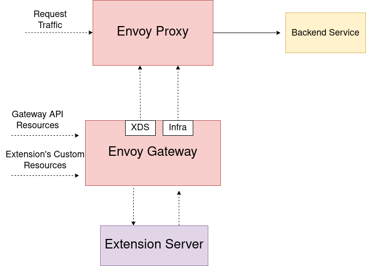

# Envoy Gateway Extensions Design

As outlined in the [official goals][] for the Envoy Gateway project, one of the main goals is to "provide a common foundation for vendors to build value-added products 
without having to re-engineer fundamental interactions". Development of the Envoy Gateway project has been focused on developing the core features for the project and 
Kubernetes Gateway API conformance. This system focuses on the “common foundation for vendors” component by introducing a way for vendors to extend Envoy Gateway.

To meaningfully extend Envoy Gateway and provide additional features, Extensions need to be able to introduce their own custom resources and have a high level of control
over the configuration generated by Envoy Gateway. Simply applying some static xDS configuration patches or relying on the existing Gateway API resources are both insufficient on their own
as means to add larger features that require dynamic user-configuration.

As an example, an extension developer may wish to provide their own out-of-the-box authentication filters that require configuration from the end-user. This is a scenario where the ability to introduce
custom resources and attach them to [HTTPRoute][]s as an [ExtensionRef][] is necessary. Providing the same feature through a series of xDS patch resources would be too cumbersome for many end-users that want to avoid
that level of complexity when managing their clusters.  

## Goals

- Provide a foundation for extending the Envoy Gateway control plane
- Allow Extension Developers to introduce their own custom resources for extending the Gateway-API via [ExtensionRefs][], [policyAttachments][] (future) and [backendRefs][] (future).
- Extension developers should **NOT** have to maintain a custom fork of Envoy Gateway
- Provide a system for extending Envoy Gateway which allows extension projects to ship updates independent of Envoy Gateway's release schedule
- An Extension can hook into both the Envoy configuration pipeline and the infra manager pipeline
- Modify the generated Envoy xDS and Envoy Gateway infra config (either directly via an xDS hook or earlier in the pipeline or by dynamically adding resources)
- Setup a foundation for the initial iteration of Extending Envoy Gateway

## Non-Goals

- The initial design does not capture every hook that Envoy Gateway will eventually support.
- Extend [Gateway API Policy Attachments][]. At some point, these will be addressed using this extension system, but the initial implementation omits these.
- Support multiple extensions at the same time. Due to the fact that extensions will be modifying xDS resources after they are generated, handling the order of extension execution for each individual hook point is a challenge. Additionally, there is no 
real way to prevent one extension from overwriting or breaking modifications to xDS resources that were made by another extension that was executed first.

## Overview

Envoy Gateway can be extended by vendors by means of an extension server developed by the vendor and deployed alongside Envoy Gateway.
An extension server can make use of one or more pre/post hooks inside Envoy Gateway before and after its major components (translator, etc.) to allow the extension to modify the data going into or coming out of these components.
An extension can be created external to Envoy Gateway as its own Kubernetes deployment or loaded as a sidecar. gRPC is used for the calls between Envoy Gateway and an extension. In the hook call, Envoy Gateway sends data as well 
as context information to the extension and expects a reply with a modified version of the data that was sent to the extension. Since extensions fundamentally alter the logic and data that Envoy Gateway provides, Extension projects assume responsibility for any bugs and issues 
they create as a direct result of their modification of Envoy Gateway.

## Diagram



## Registering Extensions in Envoy Gateway

Information about the extension that Envoy Gateway needs to load is configured in the Envoy Gateway config. The extension must specify:

- Which API groups the extension supports
- The `Kind`s supported under each API group
- Extension service connection info (host, port, TLS settings, etc.)

An example configuration:

```yaml
apiVersion: config.gateway.envoyproxy.io/v1alpha1
kind: EnvoyGateway
extension:
  apiGroups:
  - apiGroup: example.myextension.io
    apiVersion: v2
    kinds:
    - OAuth2Filter
  service:
    host: my-extension.example
    port: 443
    tls:
      type: secret
      secret:
        name: my-extension
        namespace: example
```

This configuration is required to be provided at bootstrap and modifying the registered extension during runtime is not currently supported.
Envoy Gateway will keep track of the registered extension and its `apiGroups` and `kinds` when processing Gateway API resources.

## Extending Gateway API and the Data Plane

Envoy Gateway manages [Envoy][] deployments, which act as the data plane that handles actual user traffic. Users configure the data plane using the K8s Gateway API resources which Envoy 
Gateway converts into [Envoy specific configuration (xDS)][] to send over to Envoy.

Gateway API offers [ExtensionRef filters][] and [Policy Attachments][] as extension points for implementers to use. Envoy Gateway extends the Gateway API using these extension points to provide support for [rate limiting][] 
and [authentication][]. The initial design of Envoy Gateway extensions will primarily focus on ExtensionRef filters, where users can reference a custom resource as an HTTP Filter.

When Envoy Gateway encounters an [HTTPRoute][] or [GRPCRoute][] that has an `ExtensionRef` `filter` with an `apiGroup` and `kind` that Envoy Gateway does not support, it will first
check the registered extension to determine if it supports the referenced object before considering it a configuration error.

This allows users to be able to reference additional filters provided by their Envoy Gateway Extension, in their `HTTPRoute`s / `GRPCRoute`s:

```yaml
apiVersion: example.myextension.io/v1alpha1
kind: OAuth2Filter
metadata:
  name: oauth2-filter
spec:
  ...

---
apiVersion: gateway.networking.k8s.io/v1beta1
kind: HTTPRoute
metadata:
  name: example
spec:
  parentRefs:
  - name: eg
  hostnames:
  - www.example.com
  rules:
  - clientSelectors:
    - path:
        type: PathPrefix
        value: /
    filters:
    - type: ExtensionRef
      extensionRef:
        group: example.myextension.io
        kind: OAuth2Filter
        name: oauth2-filter
    backendRefs:
    - name: backend
      port: 3000
```

In order to enable the usage of new resources introduced by an extension for translation and xDS modification, Envoy Gateway provides hook points within the translation pipeline, where it calls out to the extension service registered in the [EnvoyGateway config][] 
if they specify an `apiGroup` that matches the `group` of an `ExtensionRef` filter. The extension will then be able to modify the xDS that Envoy Gateway generated and send back the 
modified configuration. If an extension is not registered or if the registered extension does not specify support for the `group` of an `ExtensionRef` filter then Envoy Gateway will treat it as an unknown resource 
and provide an error to the user.

**Note:** Currently (as of [v1beta1][]) Gateway API does not provide a means to specify the namespace or version of an object referenced as an `ExtensionRef`. The extension mechanism will assume that
the namespace of any `ExtensionRef` is the same as the namespace of the `HTTPRoute` or `GRPCRoute` it is attached to rather than treating the `name` field of an `ExtensionRef` as a `name.namespace` string.
If Gateway API adds support for these fields then the design of the Envoy Gateway extensions will be updated to support them.

## Watching New Resources

Envoy Gateway will dynamically create new watches on resources introduced by the registered Extension. It does so by using the [controller-runtime][] to create new watches on [Unstructured][] resources that match the `apiVersion`s and `kind`s that the
registered extension configured. When communicating with an extension, Envoy Gateway sends these Unstructured resources over to the extension. This eliminates the need for the extension to create its own watches which would have a strong chance of creating race conditions and reconciliation loops when resources change. When an extension receives the Unstructured resources from Envoy Gateway it can perform its own type validation on them. Currently we make the simplifying assumption that the registered extension's `Kinds` are filters referenced by `extensionRef` in `HTTPRouteFilter`s . Support for Policy attachments will be introduced at a later time.

## Control Plane Extensions

To provide extensions the flexibility to do many things such as introduce a new authentication filter that introduces
its own new [external authorization][] server, it is also necessary to be able to extend the Control plane.

To power these use-cases, Envoy Gateway provides additional hook entrypoints to the Infra Manager which is responsible for dynamically creating the
instances of Envoy Proxy. These hook points empower an extension to modify the Envoy Proxy deployment and service dynamically.

In the example above where an extension developer wants to create a new `ExtensionRef` filter that provides authentication, they would likely deploy their own authorization service into the cluster
and make use of the extension hooks to configure Envoy to use that service to authenticate requests. By also using extension points in the control plane, the extension can dynamically
inject the authorization service as a sidecar to the Envoy deployments created by Envoy Gateway rather than deploy the authorization service in the Kubernetes cluster separately. Doing so would help to minimize the 
latency between Envoy and the authentication service and also allows the end user to spend less time worrying about how things are deployed in the cluster.


## Design Decisions

- Envoy Gateway watches new custom resources introduced by a loaded extension and passes the resources back to the extension when they are used.
  - This decision was made to solve the problem about how resources introduced by an extension get watched. If an extension server watches its own resources then it would need some way to trigger an Envoy Gateway reconfigure when a resource that Envoy Gateway is not watching gets updated. Having Envoy Gateway watch all resources removes any concern about creating race confitions or reconcile loops that would result from Envoy Gateway and the extension server both having so much separate state that needs to be synchronized.
- The Extension Server takes ownership of producing the correct xDS configuration in the hook responses
- The Extension Server will be responsible for ensuring the performance of the hook processing time

## Example: xDS Hooks API

Envoy Gateway will support the following hooks as the initial foundation of the Extension system. Additional hooks can be developed using this extension system at a later point as new use-cases and needs are discovered. The primary iteration of the extension hooks
focuses solely on the modification of xDS resources.

### Route Modification Hook

The Route Hook provides a way for an extension to modify a route generated by Envoy Gateway before it is finalized.
Doing so allows the extension to configure/modify route fields configured by Envoy Gateway and also to configure the
Route's TypedPerFilterConfig which may be desirable to do things such as pass settings and information to
ext_authz filters. The Route Hook also passes a list of Unstructured data for the externalRefs owned by the extension on the HTTPRoute that created this xDS route. The Route Hook will only be executed if an extension is loaded and only on Routes that were generated from an HTTPRoute that uses extension resources as externalRef filters.

```go
// RouteModifyRequest sends over the Route that was generated by Envoy Gateway along with some context about how it was generated
// to assist the extension in making any necessary changes to the route.
message RouteModifyRequest {
    envoy.config.route.v3.Route route = 1;
    RouteExtensionContext route_context = 2;
    repeated ExtensionResource extension_resources = 3;
}

// RouteExtensionContext provides context about an HTTPRoute/GRPCRoute containing an
// ExtensionRef. The context provided includes which filterchain/s
// and route of the object referent.
message RouteExtensionContext {
    // route_name is the name of HTTPRoute the filter is being applied on
    string route_name = 1;

    // route_namespace is the namespace the HTTPRoute is located in
    string route_namespace = 2;

    // hostnames are the fully qualified domain names attached to the HTTPRoute
    repeated string hostnames = 3;
}

// ExtensionResource stores the data for a K8s API object referenced in an HTTPRouteFilter
// extensionRef. It is constructed from an unstructured.Unstructured marshaled to JSON. An extension
// can marshal the bytes from this resource back into an unstructured.Unstructured and then 
// perform type checking to obtain the resource.
message ExtensionResource {
    bytes unstructured_bytes = 1;
}

// RouteModifyResponse contains the xDS route that was generated by Envoy Gateway after it has been modified by
// an extension
message RouteModifyResponse {
    envoy.config.route.v3.Route route = 1;
}
```

### Virtual Host Modification Hook

The VirtualHost Hook provides a way for an extension to modify a VirtualHost generated by Envoy Gateway before it is finalized.
An extension can also make use of this hook to generate and insert entirely new Routes not generated by Envoy Gateway.
The VirtualHost Hook is always executed when an extension is loaded. An extension may return an unmodified version of the VirtualHost
received in order to not make any changes to it, or return nil to cause the VirtualHost to be discarded.

```protobuf
// VirtualHostModifyRequest sends over the VirtualHost that was generated by Envoy Gateway so that an extension can modify it
// For example, an extension may want to write specific Typed Per-Filter Config for all routes.
message VirtualHostModifyRequest {
    envoy.config.route.v3.VirtualHost virtual_host = 1;
}

// VirtualHostModifyResponse contains the xDS VirtualHost that was generated by Envoy Gateway after it has been modified by
// an extension
message VirtualHostModifyResponse {
    envoy.config.route.v3.VirtualHost virtual_host = 1;
}
```

### HTTP Listener Modification Hook

The HTTP Listener modification hook is the broadest xDS modification Hook available and allows an extension to make many changes at a higher level. The HTTP Listener Hook allows an extension to make changes to a Listener after it was generated by Envoy Gateway. It is always executed when an extension is loaded. An extension may return an unmodified version of the Listener it
received in order to not make any changes to it, or return nil to cause the Listener to be discarded.

```protobuf
// HTTPListenerModifyRequest sends over the Listener that was generated by Envoy Gateway so that an extension can modify it
message HTTPListenerModifyRequest {
    envoy.config.listener.v3.Listener listener = 1;
}

// HTTPListenerModifyResponse contains the xDS Listener that was generated by Envoy Gateway after it has been modified by
// an extension
message HTTPListenerModifyResponse {
    envoy.config.listener.v3.Listener listener = 1;
}
```

### Post xDS Translation Insert Hook

The Post Translation Insert Hook allows an extension to return a list of clusters and secrets that should be injected into the xDS config. This allows for clusters that may change along with extension-specific configuration to be dynamically created rather than using custom bootstrap config which would be sufficient for clusters that are static and not prone to have their configurations changed. An example of how this may be used is to inject a cluster that will be used by an ext_authz HTTP filter created by the extension. This Hook is always executed when an extension is loaded. If the extension does not return any clusters/secrets then this is not considered an error and nothing is inserted.

```protobuf
// This Hook does not take any inputs but expects a list of clusters and/or secrets to be injected. Returning empty lists of clusters
// and/or secrets is equivalent to a no-op.
message PostTranslationInsertRequest {
}

message PostTranslationInsertResponse {
    repeated envoy.config.cluster.v3.Cluster clusters = 1;
    repeated envoy.extensions.transport_sockets.tls.v3.Secret secrets = 2;
}
```

### Extension Service

Currently, an extension must implement all of the following hooks although it may return the input(s) it received 
if no modification of the resource is desired. A future expansion of the extension hooks will allow an Extension to specify 
with config which Hooks it would like to "subscribe" to and which Hooks it does not wish to support. These specific Hooks were chosen
in order to provide extensions with the ability to have both broad and specific control over xDS resources and to minimize the amount of data being sent.

```protobuf
service EnvoyGatewayExtension {
    rpc PostRouteModify (RouteModifyRequest) returns (RouteModifyResponse) {};
    rpc PostVirtualHostModify(VirtualHostModifyRequest) returns (VirtualHostModifyResponse) {};
    rpc PostHTTPListenerModify(HTTPListenerModifyRequest) returns (HTTPListenerModifyResponse) {};
    rpc PostTranslateInsert(PostTranslationInsertRequest) returns (PostTranslationInsertResponse) {};
}
```

## Known Challenges

Extending Envoy Gateway by using an external extension server which makes use of hook points in Envoy Gateway does comes with a few trade-offs. One known trade-off is the impact of the time that it takes for the hook calls to be executed. Since an extension would make use of hook points in Envoy Gateway that use gRPC for communication, the time it takes to perform these requests could become a concern for some extension developers. One way to minimize the request time of the hook calls is to load the extension server as a sidecar to Envoy Gateway to minimize the impact of networking on the hook calls.

[official goals]: https://github.com/envoyproxy/gateway/blob/main/GOALS.md#extensibility
[ExtensionRef filters]: https://gateway-api.sigs.k8s.io/references/spec/#gateway.networking.k8s.io/v1beta1.LocalObjectReference
[ExtensionRef]: https://gateway-api.sigs.k8s.io/references/spec/#gateway.networking.k8s.io/v1beta1.LocalObjectReference
[ExtensionRefs]: https://gateway-api.sigs.k8s.io/references/spec/#gateway.networking.k8s.io/v1beta1.LocalObjectReference
[backendRefs]: https://gateway-api.sigs.k8s.io/references/spec/#gateway.networking.k8s.io/v1beta1.BackendObjectReference
[Gateway API Policy attachments]: https://gateway-api.sigs.k8s.io/references/policy-attachment/?h=policy
[Policy Attachments]: https://gateway-api.sigs.k8s.io/references/policy-attachment/?h=policy
[policyAttachments]: https://gateway-api.sigs.k8s.io/references/policy-attachment/?h=policy
[Envoy]: https://www.envoyproxy.io/
[Envoy specific configuration (xDS)]: https://www.envoyproxy.io/docs/envoy/v1.25.1/configuration/configuration
[v1beta1]: https://gateway-api.sigs.k8s.io/references/spec/#gateway.networking.k8s.io%2fv1beta1
[rate limiting]: https://gateway.envoyproxy.io/v0.3.0/user/rate-limit.html
[authentication]: https://gateway.envoyproxy.io/v0.3.0/user/authn.html
[HTTPRoute]: https://gateway-api.sigs.k8s.io/references/spec/#gateway.networking.k8s.io/v1beta1.HTTPRoute
[GRPCRoute]: https://gateway-api.sigs.k8s.io/references/spec/#gateway.networking.k8s.io/v1alpha2.GRPCRoute
[EnvoyGateway config]: https://gateway.envoyproxy.io/v0.3.0/api/config_types.html#envoygateway
[external authorization]: https://www.envoyproxy.io/docs/envoy/latest/configuration/http/http_filters/ext_authz_filter
[controller-runtime]: https://github.com/kubernetes-sigs/controller-runtime
[Unstructured]: https://pkg.go.dev/k8s.io/apimachinery/pkg/apis/meta/v1/unstructured
