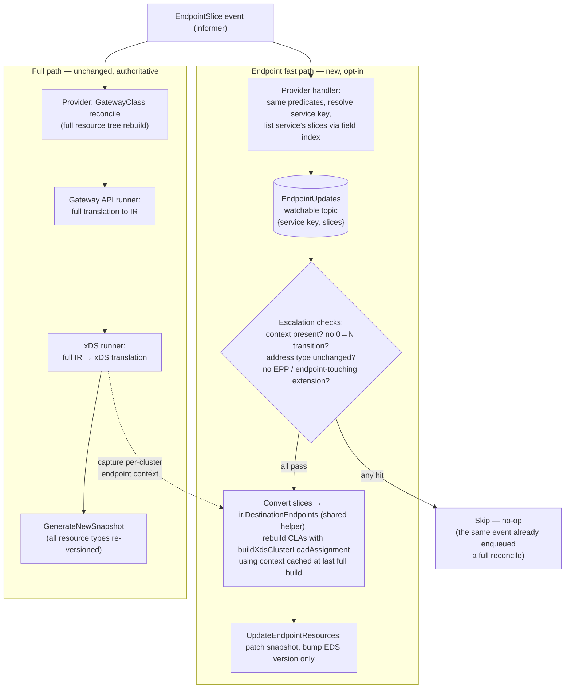

Design for [#9777](https://github.com/envoyproxy/gateway/issues/9777).

## Overview

In large clusters, endpoint updates are delayed by however long a full translation takes,
because endpoints only reach Envoy by riding along in a complete rebuild of everything.
Every EndpointSlice event takes the full pipeline today:

1. **Provider**: a full reconcile rebuilds the entire resource tree for the GatewayClass
   (`gatewayAPIReconciler.Reconcile` discards the request and re-lists everything).
2. **Gateway API runner**: a full translation of all resources to IR.
3. **xDS runner**: a full translation of the IR to all xDS resource types, then a new snapshot.

While a build is in flight, watchable coalescing merges incoming updates into the next build,
so endpoints continuously lag by roughly one full build duration. At large scale
(tens of thousands of routes, expensive EnvoyPatchPolicy JSON patches), a single full
translation can take multiple seconds to tens of seconds; under sustained pod churn, builds
run back-to-back and endpoint staleness is sustained rather than episodic.

The structural mismatch: endpoints change at pod timescale (rollouts, autoscaling, node
drains) while routes and policies change at human timescale — endpoint updates are orders of
magnitude more frequent than any other input, yet they pay the cost of the most expensive
machinery. Optimizing translation shrinks the staleness window; only decoupling removes the
failure class where one tenant's expensive or invalid configuration delays endpoint delivery
for every tenant sharing the control plane.

This design adds an opt-in **endpoint fast path**: EndpointSlice changes are published on a
dedicated channel and translated into updated `ClusterLoadAssignment`s using a cached
per-cluster endpoint context from the last successful full build, then patched into the
current snapshot with only the EDS version bumped. Semantics are **best-effort**: fresh
endpoints against last-known-good config. Full builds remain authoritative and re-apply the
latest endpoint state on publish.

**Prior art:** Istio's incremental (EDS-only) push — endpoint updates bypass `PushContext`
recomputation, regenerate only affected `ClusterLoadAssignment`s, and escalate to a full push
when cluster-level config is affected (`DiscoveryServer.EDSUpdate`,
`EndpointIndex.UpdateServiceEndpoints`).

## Goals

* Bound endpoint staleness independently of full-translation cost.
* Opt-in, with zero behavior change when disabled.
* Full builds remain authoritative; the fast path never produces state a full build would not
  eventually produce.
* Reuse the existing translation functions on the fast path so both paths compute endpoints
  identically.

## Non Goals

* Incremental translation of anything other than endpoints (no incremental CDS/LDS/RDS).
* Changing status reporting. Conditions derived from endpoints (e.g.
  `BackendsAvailable: EndpointsNotFound`) continue to be computed only by the full path.
* Covering DNS or dynamic-resolver backends. They never produce EDS resources — for
  `EndpointTypeDNS` the `ClusterLoadAssignment` is inlined into the Cluster, and dynamic
  resolvers have none — so there is nothing to fast-path.
* Changes to the xDS protocol usage (delta ADS remains as is).

## Implementation

### Data flow



The fast path is purely additive: the existing EndpointSlice watch keeps enqueueing full
reconciles, which both keep the resource tree fresh and act as the escalation target.
"Escalate" therefore means "do nothing on the fast path".

### 1. New message topic

`internal/message` gains an `EndpointUpdates` watchable map:

* Key: the backend service key, `"<kind>/<namespace>/<name>"` (kinds: `Service`,
  `ServiceImport`).
* Value: an `EndpointUpdateWithContext` wrapper mirroring `XdsIRWithContext`
  (`Equal`/`DeepCopy`/`StoredAt`/parent trace context), carrying the full current set of
  EndpointSlices for that service.

The topic is allocated and closed in `internal/cmd/server.go` alongside `xdsIR`/`infraIR`
and wired into the provider and xDS runner configs. Watchable's `DeepEqual`-based
suppression drops no-op publishes (e.g. resyncs); `message.HandleSubscription` +
`coalesceUpdates` give the same per-key last-write-wins batching as the existing topics,
and the same queue-wait metrics/spans apply.

Publishing the **full current slice set** (listed from the informer cache via the existing
`serviceEndpointSliceIndex` / `serviceImportEndpointSliceIndex` field indexes) rather than
the single changed slice keeps the consumer stateless with respect to slice merging and makes
each update self-contained — last write wins is then safe under coalescing.

### 2. Provider: publishing endpoint updates

A second handler on the existing EndpointSlice watch in
`gatewayAPIReconciler.watchResources` (`internal/provider/kubernetes/controller.go`):

* Reuses the exact predicate chain used today (`validateEndpointSliceForReconcile`,
  namespace-label filtering), so the fast path only ever fires for slices that would have
  triggered a reconcile anyway.
* Resolves the service key from the slice labels, lists the service's slices through the
  field index, and stores on the `EndpointUpdates` topic.
* Requires the `EndpointSliceIndex` runtime flag (default on); with it disabled, the fast
  path is disabled too.

The existing handler that enqueues the GatewayClass reconcile is untouched.

### 3. IR extension: endpoint provenance on `DestinationSetting`

The fast path must map "service X changed" to "these clusters, with these slice-filtering
parameters". Today `ir.DestinationSetting.Metadata` (from `buildResourceMetadata`) already
records the backend's kind/namespace/name, but the EndpointSlice port filter matches by
**service port name** and protocol (`getIREndpointsFromEndpointSlices`), which only exist
transiently inside `processServiceDestinationSetting`.

Add a small selector to `ir.DestinationSetting`, populated by
`processServiceDestinationSetting` / `processServiceImportDestinationSetting` when the
feature is enabled:

```go
// EndpointSource identifies the Kubernetes backend an EDS-managed
// DestinationSetting's endpoints are derived from, so endpoint updates can be
// re-resolved without a full translation.
type EndpointSource struct {
    Kind      string // Service | ServiceImport
    Namespace string
    Name      string
    PortName  string          // service port name used to filter slice ports
    Protocol  corev1.Protocol // TCP | UDP | SCTP
}
```

It is only set for endpoint-routed (`EndpointTypeStatic`, i.e. EDS) settings — never for
ClusterIP/service routing, FQDN, custom backends, or dynamic resolvers. With this field the
service→cluster mapping is derivable from the published IR alone; no side-channel artifact
has to be kept in sync with the IR.

### 4. Per-cluster endpoint context, captured at full translation

Rebuilding a CLA needs more than addresses: the destination settings (weights, priorities,
zone, TLS presence and **setting index** — the `envoy.transport_socket_match` metadata name
embeds it as `"<clusterName>/tls/<i>"`), active health-check overrides, and the
locality strategy (`PreferLocal`, `WeightedZones` from BackendTrafficPolicy). All of these
converge at exactly one place during full translation: `addXdsCluster` /
`buildXdsClusterLoadAssignment` in `internal/xds/translator`.

When the feature is enabled, the xDS translator records, for every EDS cluster it emits:

```
clusterName → {
    settings      []*ir.DestinationSetting   // incl. EndpointSource + setting order
    healthCheck   *ir.HealthCheck
    preferLocal   *ir.PreferLocalZone
    weightedZones []*ir.WeightedZone
}
```

indexed by service key (one service may feed many clusters; one cluster may have several
settings from different services). The xDS runner keeps this context per IR key and replaces
it atomically on every successful full build, together with a fast-path enablement verdict
for that key (see escalation). Because the context is captured from the same pass that
produced the snapshot, context and snapshot can never disagree.

`buildXdsClusterLoadAssignment` is a pure function of exactly these inputs, so the fast path
re-invokes it unchanged — CLA construction has a single implementation shared by both paths.

### 5. Shared slice→endpoint conversion

`getIREndpointsFromEndpointSlices` / `getIREndpointsFromEndpointSlice`
(currently unexported in `internal/gatewayapi/route.go`) are pure functions of
(slices, port name, port protocol) that produce `[]*ir.DestinationEndpoint` and the
`DestinationAddressType`, handling ready/serving/terminating (draining), zones, and
multi-address endpoints. They move to a shared package (e.g. `internal/utils/endpoints`)
because `internal/gatewayapi` imports `internal/xds`, so the xDS runner cannot import
`gatewayapi` without a cycle. Both paths call the shared helper, guaranteeing identical
endpoint semantics.

### 6. EDS-only snapshot patch

`SnapshotCacheWithCallbacks` (`internal/xds/cache/snapshotcache.go`) gains:

```go
UpdateEndpointResources(irKey string, clas []types.Resource, ctx context.Context) error
```

go-control-plane's `Snapshot.Resources` is per-type-URL versioned; `GenerateNewSnapshot`
merely stamps the same version on every type. The patch:

1. Takes the existing snapshot for `irKey`; if none, skip (nothing to patch).
2. **Clones** it — the `*Snapshot` pointer is shared with live streams, and
   `ConstructVersionMap` short-circuits once `VersionMap` is populated, so in-place mutation
   would race readers and leave delta streams with a stale version map.
3. Replaces the changed CLAs inside `Resources[types.Endpoint]` (merging with unchanged
   ones) under a fresh EDS version from the existing monotonic counter; all other types keep
   their versions.
4. Carries the previous `VersionMap` entries forward for unchanged type URLs and re-hashes
   only the EDS entries (via a small custom `cachev3.ResourceSnapshot` implementation).
   Envoy is driven over **delta ADS** (`DELTA_GRPC` in the bootstrap), where go-control-plane
   already dedups per resource by hash — so avoiding the full re-hash of every resource type
   is where much of the CPU saving on the push side comes from. SOTW streams are naturally
   quiet for non-EDS types because per-type versions are unchanged.
5. Stores the new snapshot in `lastSnapshot[irKey]` (reconnecting nodes are served from it)
   and calls `SetSnapshot` for each node whose `node.Cluster == irKey`.

Full builds continue to go through `GenerateNewSnapshot` unchanged.

### 7. Escalation: when the fast path must stand down

The fast path only handles changes that are provably CLA-only. Anything else is left to the
full path (which the same event already triggered). Two categories:

**Per-key disablement**, decided once per full build and cached with the context:

* The IR for the key contains any `EnvoyPatchPolicy`. Patches can target
  `ClusterLoadAssignment` directly (whole-resource adds or JSON patches against EDS), the
  mutations are applied in place and invisible afterwards, and EnvoyPatchPolicy statuses are
  only refreshed by the full path. (A later refinement could disable only when some patch's
  type is `ClusterLoadAssignment`; v1 keeps the conservative rule.)
* The extension manager has a post-xDS hook registered for `Endpoints`, `Cluster`, or
  `Translation`. `PostEndpointsModify` rewrites CLAs directly; `PostClusterModify` /
  `PostTranslateModify` can change cluster discovery config or membership. All mutate via
  deep-copy-in-place, so the decision must come from hook registration, not from diffing
  results.

**Per-update skip**, decided when consuming an endpoint update:

* Service key absent from the context — the backend is not referenced by any EDS cluster,
  or no successful full build has happened yet.
* Any affected `DestinationSetting` crosses **zero ↔ non-zero** endpoints. Zero-endpoint
  transitions are not CLA-only: the Gateway API translator collapses the setting to an
  empty stub (dropping protocol/TLS/address type), backend-cluster deduplication membership
  changes (cluster names appear/disappear), routes flip to 503 direct responses or synthetic
  invalid-backend weighted clusters, and `BackendsAvailable` status changes.
* The recomputed **address type differs** from the cached one (IP ↔ FQDN ↔ MIXED) — this
  flips the cluster between EDS and DNS-inlined load assignment, a CDS-shape change.

What remains — the overwhelmingly common cases — is handled by the fast path: endpoint
addresses added or removed while the count stays above zero, readiness/draining flips, and
zone changes on existing endpoints.

### 8. Consistency model

Best-effort: **fresh endpoints against last-known-good config**. Invariants:

* **Mutual exclusion per IR key** inside the xDS runner between full snapshot generation and
  fast-path patches (the two arrive on different subscriptions/goroutines).
* **Re-apply on full publish.** A full build lists slices when the provider reconcile starts;
  a fast-path update can arrive while that build is in flight, so a freshly published full
  snapshot may carry older endpoints than the last fast-path patch. To keep the snapshot from
  regressing, after each full `GenerateNewSnapshot` the runner rebuilds the endpoint context
  from the new build and immediately re-applies the most recent endpoint state it has
  received on the fast channel for the affected services (an EDS-only patch on top, skipped
  when it hashes identical). The event stream and the reconcile's Lists read the same
  informer store, so any state the fast channel hasn't seen yet has a pending event behind it
  — the system converges to the informer's latest state on both paths.

  ```mermaid
  sequenceDiagram
      participant K as Informer store
      participant FP as Fast path
      participant FB as Full build
      participant SC as Snapshot cache

      Note over FB: build B starts,<br/>lists slices at state T0
      K->>FP: endpoint event E1 (state T1)
      FP->>SC: EDS-only patch (T1 endpoints)
      Note over FB: build B finishes<br/>(still carries T0 endpoints)
      FB->>SC: GenerateNewSnapshot (T0 endpoints)
      Note over SC: without re-apply: endpoints<br/>regress T1 → T0
      FB->>FP: rebuild context from build B
      FP->>SC: re-apply latest fast-path state<br/>(EDS-only patch, T1 endpoints)
      Note over SC: snapshot never serves<br/>endpoints older than T1
  ```
* Endpoint state observed only by the fast path is never *load-bearing*: if Envoy Gateway
  restarts, the first full build re-lists everything and produces the same result.

### 9. Opt-in

A new runtime flag, following the established pattern for risky/temporary behavioral
features (`api/v1alpha1/envoygateway_types.go`):

```go
// EndpointFastPath enables propagating EndpointSlice updates to Envoy as
// EDS-only pushes without waiting for a full translation. Endpoint changes
// that affect configuration (e.g. a backend's endpoint count crossing zero)
// still take the full path. Disabled by default.
EndpointFastPath RuntimeFlag = "EndpointFastPath"
```

Default `false` in `defaultRuntimeFlags`. Effective only when `EndpointSliceIndex` is also
enabled (its default). `ExtensionAPIs` is not used — it gates user-facing API surface, not
internal behavior.

### 10. Observability

* `endpoint_fastpath_patch_total` (success/failure) — EDS-only patches applied.
* `endpoint_fastpath_skipped_total{reason=...}` — per-update skips
  (`no_context`, `zero_transition`, `address_type_change`, `disabled_for_key`).
* Existing `xds_snapshot_update_total` continues to count pushes; the patch path adds a
  tracing span symmetric to the existing `SnapshotCache.GenerateNewSnapshot` span, and the
  new topic gets the standard watchable queue-wait metrics.

The headline benchmark: endpoint-propagation latency (event → `SetSnapshot`) under a
deliberately slow configuration (large route count and/or expensive EnvoyPatchPolicies),
fast path off vs. on, using the churn methodology from #9773/#9803.

## Alternatives considered

* **Optimizing translation only.** Worthwhile independently, but leaves endpoint freshness
  coupled to worst-case configuration cost; the failure class remains.
* **Routing the fast path through the Gateway API runner** (provider → gatewayapi runner →
  endpoints-IR topic → xDS runner). Keeps slice→IR conversion in its home package, but adds
  a hop and a second topic, the endpoint events would queue behind multi-second full
  translations in the same subscription goroutine, and the xDS side still needs the
  per-cluster context to rebuild CLAs — the middleman removes no state. Extracting the pure
  conversion helper preserves the layering benefit without the cost.
* **A side-channel endpoint-context artifact published next to the IR**, or the provider
  shipping Service port information with each event. Both split the context across sources
  that must be kept in sync; deriving the mapping from the IR plus capturing CLA arguments
  during the translation pass that produced the snapshot keeps a single source of truth.
* **Re-running extension endpoint hooks / CLA patches on the fast path.** Would keep the
  fast path available for extension users, but puts gRPC hook calls on the hot path and
  duplicates patch-application semantics; deferred until there is demand.
