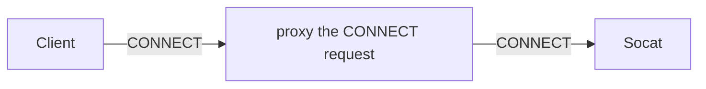

HTTP CONNECT tunnels are a mechanism that allows a client to establish a tunnel through an HTTP proxy server 
to communicate directly with a destination server. This is commonly used for HTTPS traffic through proxies, 
but can also be used for other protocols.

This task will help you get started using HTTP Connect based tunnels using Envoy Gateway.

## Prerequisites



## Proxy CONNECT request

Envoy Gateway supports proxy CONNECT requests, allowing you to route traffic through a Gateway and HTTPRoute to a Backend service.



Create a Gateway and HTTPRoute to route proxy CONNECT requests to a Backend service:

```shell
cat <<EOF | kubectl apply -f -
# curl -ik -v -x 172.18.0.201:80 https://www.httpbin.org | grep -o "<title>.*</title>"
apiVersion: gateway.networking.k8s.io/v1
kind: Gateway
metadata:
  name: connect-proxy
spec:
  gatewayClassName: eg
  listeners:
    - name: http
      protocol: HTTP
      port: 80
---
apiVersion: gateway.networking.k8s.io/v1
kind: HTTPRoute
metadata:
  name: connect-proxy
spec:
  parentRefs:
    - group: gateway.networking.k8s.io
      kind: Gateway
      name: connect-proxy
  rules:
    - backendRefs:
        - group: ""
          kind: Service
          name: socat
          port: 8080
      matches:
        - path:
            type: PathPrefix
            value: /
---
apiVersion: gateway.envoyproxy.io/v1alpha1
kind: BackendTrafficPolicy
metadata:
  name: connect-proxy
spec:
  targetRef:
    group: gateway.networking.k8s.io
    kind: Gateway
    name: connect-proxy
  httpUpgrade:
    - type: CONNECT
---
apiVersion: apps/v1
kind: Deployment
metadata:
  name: socat
spec:
  selector:
    matchLabels:
      app: socat
  template:
    metadata:
      labels:
        app: socat
    spec:
      serviceAccountName: socat
      containers:
        - name: socat
          image: alpine/socat:1.8.0.3
          command:
            - socat
            - TCP-LISTEN:8080,fork,reuseaddr
            - TCP:httpbin.org:80
          imagePullPolicy: IfNotPresent
---
apiVersion: v1
kind: ServiceAccount
metadata:
  name: socat
---
apiVersion: v1
kind: Service
metadata:
  name: socat
  labels:
    app: socat
spec:
  ports:
    - port: 8080
      name: http
  selector:
    app: socat
---
EOF
```

Verify the Gateway status:

```shell
kubectl get gateway/connect-proxy -o yaml
```

### Testing


{}

Get the External IP of the Gateway:

```shell
export PROXY_GATEWAY_HOST=$(kubectl get gateway/connect-proxy -o jsonpath='{.status.addresses[0].value}')
```

```shell
curl -ik -v -x ${PROXY_GATEWAY_HOST}:80 https://httpbin.org | grep -o "<title>.*</title>"
```

Verify the method from the access log:

```shell
kubectl logs -n envoy-gateway-system deployments/envoy-default-connect-proxy-f7d7286e | tail -n 1 | jq | grep method
```

{}
{}

Get the name of the Envoy service created the by the example Gateway:

```shell
export ENVOY_SERVICE=$(kubectl get svc -n envoy-gateway-system --selector=gateway.envoyproxy.io/owning-gateway-namespace=default,gateway.envoyproxy.io/owning-gateway-name=connect-proxy -o jsonpath='{.items[0].metadata.name}')
```

Port forward to the Envoy service:

```shell
kubectl -n envoy-gateway-system port-forward service/${ENVOY_SERVICE} 8080:80 &
```

```shell
curl -ik -v -x localhost:8080 https://httpbin.org
```

{}


## Clean up

```shell
kubectl delete HTTPRoute connect-proxy
kubectl delete Gateway connect-proxy
kubectl delete BackendTrafficPolicy connect-proxy
kubectl delete deployment socat
kubectl delete service socat
kubectl delete serviceaccount socat
```