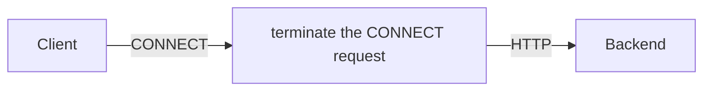
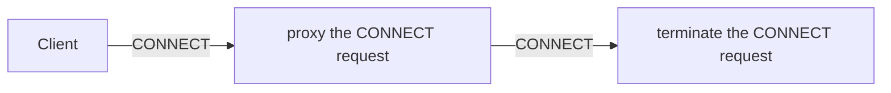

HTTP CONNECT tunnels are a mechanism that allows a client to establish a tunnel through an HTTP proxy server 
to communicate directly with a destination server. This is commonly used for HTTPS traffic through proxies, 
but can also be used for other protocols.

This task will help you get started using HTTP Connect based tunnels using Envoy Gateway.

## Prerequisites



## Terminate CONNECT request

Envoy Gateway supports terminating CONNECT requests, allowing you to route traffic through a Gateway and HTTPRoute to a Backend service.




Create a Gateway and HTTPRoute to route terminate CONNECT requests to a Backend service:

```shell
cat <<EOF | kubectl apply -f -
apiVersion: gateway.networking.k8s.io/v1
kind: Gateway
metadata:
  name: connect-terminate
spec:
  gatewayClassName: eg
  listeners:
    - name: http
      protocol: HTTP
      port: 80
---
apiVersion: gateway.networking.k8s.io/v1
kind: HTTPRoute
metadata:
  name: connect-terminate
spec:
  parentRefs:
    - group: gateway.networking.k8s.io
      kind: Gateway
      name: connect-terminate
  rules:
    - backendRefs:
        - group: ""
          kind: Backend
          name: backend-fqdn
      matches:
        - path:
            type: PathPrefix
            value: /
---
apiVersion: gateway.envoyproxy.io/v1alpha1
kind: Backend
metadata:
  name: backend-fqdn
spec:
  endpoints:
    - fqdn:
        hostname: www.google.com
        port: 443
---
apiVersion: gateway.envoyproxy.io/v1alpha1
kind: BackendTrafficPolicy
metadata:
  name: connect-terminate
spec:
  targetRef:
    group: gateway.networking.k8s.io
    kind: Gateway
    name: connect-terminate
  httpUpgrade:
    - type: CONNECT
      connect:
        terminate: true
---
EOF
```

Verify the Gateway status:

```shell
kubectl get gateway/connect-terminate -o yaml
```

### Testing


{}

Get the External IP of the Gateway:

```shell
export TERMINATE_GATEWAY_HOST=$(kubectl get gateway/connect-terminate -o jsonpath='{.status.addresses[0].value}')
```


```shell
curl -ik -v -x ${TERMINATE_GATEWAY_HOST}:80 https://www.google.com | grep -o "<title>.*</title>"
```

{}
{}

Get the name of the Envoy service created the by the example Gateway:

```shell
export ENVOY_SERVICE=$(kubectl get svc -n envoy-gateway-system --selector=gateway.envoyproxy.io/owning-gateway-namespace=default,gateway.envoyproxy.io/owning-gateway-name=connect-terminate -o jsonpath='{.items[0].metadata.name}')
```

Port forward to the Envoy service:

```shell
kubectl -n envoy-gateway-system port-forward service/${ENVOY_SERVICE} 8080:80 &
```

```shell
curl -ik -v -x localhost:8080 https://www.google.com
```

{}



## Proxy CONNECT request

Envoy Gateway supports proxy CONNECT requests, allowing you to route traffic through a Gateway and HTTPRoute to a Backend service.



Create a Gateway and HTTPRoute to route proxy CONNECT requests to a Backend service:

```shell
cat <<EOF | kubectl apply -f -
apiVersion: gateway.networking.k8s.io/v1
kind: Gateway
metadata:
  name: connect-proxy
spec:
  gatewayClassName: eg
  listeners:
    - name: http
      protocol: HTTP
      port: 80
---
apiVersion: gateway.networking.k8s.io/v1
kind: HTTPRoute
metadata:
  name: connect-proxy
spec:
  parentRefs:
    - group: gateway.networking.k8s.io
      kind: Gateway
      name: connect-proxy
  rules:
    - backendRefs:
        - group: ""
          kind: Service
          name: connect
          port: 8080
      matches:
        - path:
            type: PathPrefix
            value: /
---
apiVersion: gateway.envoyproxy.io/v1alpha1
kind: BackendTrafficPolicy
metadata:
  name: connect-proxy
spec:
  targetRef:
    group: gateway.networking.k8s.io
    kind: Gateway
    name: connect-proxy
  httpUpgrade:
    - type: CONNECT
---
apiVersion: v1
kind: ServiceAccount
metadata:
  name: connect-teminate
---
apiVersion: v1
kind: Service
metadata:
  name: connect-teminate
  labels:
    app: connect-teminate
spec:
  ports:
    - port: 8080
      name: http
  selector:
    app: connect-teminate
---
apiVersion: v1
kind: ConfigMap
metadata:
  name: connect-teminate
data:
  envoy.yaml: |
    admin:
      address:
        socket_address:
          protocol: TCP
          address: 127.0.0.1
          port_value: 9902
    static_resources:
      listeners:
      - name: listener_0
        address:
          socket_address:
            protocol: TCP
            address: 0.0.0.0
            port_value: 8080
        filter_chains:
        - filters:
          - name: envoy.filters.network.http_connection_manager
            typed_config:
              "@type": type.googleapis.com/envoy.extensions.filters.network.http_connection_manager.v3.HttpConnectionManager
              stat_prefix: ingress_http
              route_config:
                name: local_route
                virtual_hosts:
                - name: local_service
                  domains:
                  - "*"
                  routes:
                  - match:
                      connect_matcher:
                        {}
                      headers:
                      - name: foo
                        string_match:
                          exact: bar
                    route:
                      cluster: local_original_dst
                      upgrade_configs:
                      - upgrade_type: CONNECT
                        connect_config:
                          {}
                  - match:
                      connect_matcher:
                        {}
                    route:
                      cluster: service_google
                      upgrade_configs:
                      - upgrade_type: CONNECT
                        connect_config:
                          {}
              http_filters:
              - name: envoy.filters.http.router
                typed_config:
                  "@type": type.googleapis.com/envoy.extensions.filters.http.router.v3.Router
              http_protocol_options: {}
      clusters:
      - name: service_google
        connect_timeout: 0.25s
        type: LOGICAL_DNS
        # Comment out the following line to test on v6 networks
        dns_lookup_family: V4_ONLY
        lb_policy: ROUND_ROBIN
        load_assignment:
          cluster_name: service_google
          endpoints:
          - lb_endpoints:
            - endpoint:
                address:
                  socket_address:
                    address: www.google.com
                    port_value: 443
      - name: local_original_dst
        connect_timeout: 0.25s
        type: ORIGINAL_DST
        lb_policy: CLUSTER_PROVIDED
        original_dst_lb_config:
          use_http_header: true
          http_header_name: ":authority"
---
apiVersion: apps/v1
kind: Deployment
metadata:
  name: connect-teminate
spec:
  selector:
    matchLabels:
      app: connect-teminate
  template:
    metadata:
      labels:
        app: connect-teminate
    spec:
      serviceAccountName: connect
      containers:
        - name: envoyproxy
          image: envoyproxy/envoy:v1.35.0
          volumeMounts:
            - mountPath: /etc/envoy/
              name: envoy-cfg
          imagePullPolicy: IfNotPresent
      volumes:
        - name: envoy-cfg
          configMap:
            name: connect-teminate
            optional: true
---
EOF
```

Verify the Gateway status:

```shell
kubectl get gateway/connect-proxy -o yaml
```

### Testing


{}

Get the External IP of the Gateway:

```shell
export PROXY_GATEWAY_HOST=$(kubectl get gateway/connect-proxy -o jsonpath='{.status.addresses[0].value}')
```

```shell
curl -ik -v -x ${PROXY_GATEWAY_HOST}:80 https://www.google.com | grep -o "<title>.*</title>"
```

{}
{}

Get the name of the Envoy service created the by the example Gateway:

```shell
export ENVOY_SERVICE=$(kubectl get svc -n envoy-gateway-system --selector=gateway.envoyproxy.io/owning-gateway-namespace=default,gateway.envoyproxy.io/owning-gateway-name=connect-proxy -o jsonpath='{.items[0].metadata.name}')
```

Port forward to the Envoy service:

```shell
kubectl -n envoy-gateway-system port-forward service/${ENVOY_SERVICE} 8080:80 &
```

```shell
curl -ik -v -x localhost:8080 https://www.google.com
```

{}


## Clean up

```shell
kubectl delete HTTPRoute connect-proxy connect-terminate
kubectl delete Gateway connect-proxy connect-terminate
kubectl delete Backend backend-fqdn
kubectl delete BackendTrafficPolicy connect-proxy connect-terminate
kubectl delete deployment connect-teminate
kubectl delete service connect-teminate
kubectl delete serviceaccount connect-teminate
kubectl delete cm connect-teminate
```